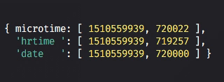

# precision-timestamp

Gets a precise (to the microsecond) UNIX timestamp.



## Installation

```console
$ yarn add precision-timestamp
```

## Usage

The returned function is a wrapper for either `microtime` (see _Optimizing_),
`process.hrtime()` or `Date.now()`.

```javascript
const ptime = require('precision-timestamp');

console.log(ptime()); //-> [12184342834, 23942834]
                      //         ^           ^
                      //      seconds   microseconds
```

## Optimizing

By default, most Node instances are going to default to the `process.hrtime()` implementation
which should be entirely sufficient.

However, for a considerable performance improvement, install the `microtime` package alongside
this one. This package will automatically detect and wrap it for you.

In the worst of cases where `process.hrtime()` _and_ `microtime` are unavailable, the library
defaults to `Date.now()`, which is only accurate to the nearest millisecond. In these situations,
a process warning is emitted.

# License
Copyright &copy; 2017 The STDTRACE organization and ZEIT, Inc. Released under the [MIT License](LICENSE).
